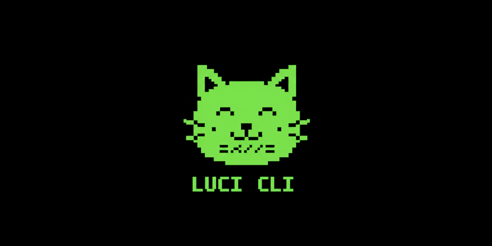

[](https://github.com/mmoehabb/luci/releases/tag/v0.0.3)
[](https://github.com/mmoehabb/luci/blob/main/LICENSE)

# About

A simple CLI that unifies writting shell commands script files for different operating systems.

## Install

```shell
go install github.com/mmoehabb/luci@latest
```

## Why Luci?

If you're a GNU/Linux developer, you’ve likely encountered this situation many times:
You write a handful of convenient bash scripts to automate repetitive tasks in your project — compiling firmware,
flashing different microcontrollers, running code formatters with specific options, generating documentation, or
preparing release artifacts.

These scripts work beautifully on your machine. Then someone on Windows (or occasionally macOS) clones the repository,
tries to contribute or just build the project, and immediately runs into friction:

- bash is not available by default
- line endings cause subtle problems
- paths with spaces behave differently
- environment variable syntax differs
- command names or flags are subtly incompatible

The usual workarounds are:

- Write & maintain equivalent .bat / .cmd / PowerShell versions
- Write POSIX sh variants + ask everyone to use git bash / WSL / Cygwin
- Add a long README section explaining “how to make it work on Windows”
- Tell Windows users “just use WSL” (which many perceive as hostile UX)

Luci handles this issue by using a toml config file instead of, e.g., bash scripts; this gives
better structure for the project, along with universal usibility.

Example of what this can look like:

```toml
title = "Hello World Example"
description = "Just a simple example of using luci."

[bash]
example = "echo Hello World!"

[bash.run]
exm1 = "echo Example 1"

[bash.run.exm2]
title = "Example 2 Title"
description = "Example 2 Description"
value = "echo Example 2"

[bash.run.exm3.value]
action1 = "echo Example 3 Action 1"
action2 = "echo Example 3 Action 2"
```
