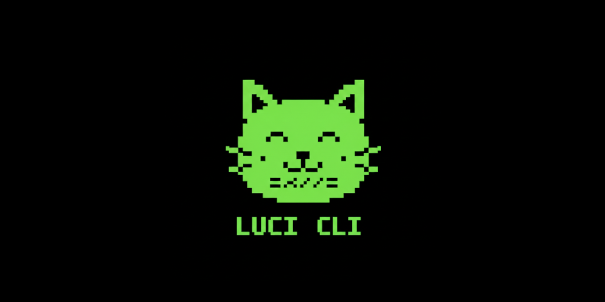

[](https://github.com/mmoehabb/luci/releases/tag/v0.0.5)
[](https://github.com/mmoehabb/luci/blob/main/LICENSE)

# About

A simple CLI that unifies writting shell commands script files for different operating systems.

## Install

```shell
go install github.com/mmoehabb/luci@latest
```

## Why Luci?

If you're a GNU/Linux developer, you’ve likely encountered this situation many times:
You write a handful of convenient bash scripts to automate repetitive tasks in your project — compiling firmware,
flashing different microcontrollers, running code formatters with specific options, generating documentation, or
preparing release artifacts.

These scripts work beautifully on your machine. Then someone on Windows (or occasionally macOS) clones the repository,
tries to contribute or just build the project, and immediately runs into friction:

- bash is not available by default
- line endings cause subtle problems
- paths with spaces behave differently
- environment variable syntax differs
- command names or flags are subtly incompatible

The usual workarounds are:

- Write & maintain equivalent .bat / .cmd / PowerShell versions
- Write POSIX sh variants + ask everyone to use git bash / WSL / Cygwin
- Add a long README section explaining “how to make it work on Windows”
- Tell Windows users “just use WSL” (which many perceive as hostile UX)

Luci handles this issue by using a toml config file instead of, e.g., bash scripts; this gives
better structure for the project, along with universal usibility.

Example of what this can look like:

```toml
title = "Hello World Example"
description = "Just a simple example of using luci."

[bash]
example = "echo Hello World!"

[bash.run]
exm1 = "echo Example 1"

[bash.run.exm2]
title = "Example 2 Title"
description = "Example 2 Description"
value = "echo Example 2"

[bash.run.exm3.value]
action1 = "echo Example 3 Action 1"
action2 = "echo Example 3 Action 2"
```

## Design & Architecture

### Architecture Overview

Luci operates as a thin translation layer between a structured TOML configuration and platform-specific shell execution. At runtime, Luci detects the operating system, loads the configuration, resolves the requested action, and executes it through the appropriate shell interpreter.

```
┌─────────────────┐     ┌─────────────────┐     ┌─────────────────┐
│  luci.config    │     │     Luci        │     │   OS Shell      │
│    .toml        │────▶│   (Go binary)   │────▶│  /bin/sh, zsh,  │
│                 │     │                 │     │  cmd.exe        │
└─────────────────┘     └─────────────────┘     └─────────────────┘
```

The configuration defines actions per-shell (bash, zshell, bat), allowing a single file to specify platform-appropriate commands. Actions can be nested arbitrarily, with optional metadata (title, description) for enhanced UX in interactive mode.

### Directory Structure

```
luci/
├── main.go              # CLI entry point, flag parsing, command routing
├── types/
│   └── types.go         # Core type definitions (Config, ShellConfig, AnnotatedAction)
├── utils/
│   ├── config.go        # TOML configuration loading and parsing
│   ├── action.go        # Recursive action resolution (Dig function)
│   ├── actions.go       # Action tree construction (CollectActions)
│   ├── exec.go          # Platform-specific command execution
│   ├── print.go         # Interactive TUI and non-interactive output
│   └── utils.go         # Shell detection and helper utilities
├── tests/
│   └── action_test.go   # Test suite for Dig and MapToAnnotatedAction
└── examples/
    └── luci.arduino-cli.toml  # Real-world ESP8266/NodeMCU development helper
```

### Key Components

| Component | Responsibility |
|-----------|----------------|
| `main.go` | Parses CLI flags (`--list`, `--version`), routes to handlers or launches interactive TUI |
| `types.go` | Defines core data model: `Config`, `ShellConfig`, `AnnotatedAction`, `ShellType` |
| `config.go` | Loads `luci.config.toml`, handles interactive config creation on first run |
| `action.go` | `Dig()` recursively traverses nested maps; `MapToAnnotatedAction()` converts raw maps to typed actions |
| `actions.go` | `CollectActions()` builds an `ActionNode` tree distinguishing leaf actions from group containers |
| `exec.go` | `Act()` resolves and executes actions; `execAction()` delegates to `/bin/sh`, `/bin/zsh`, or `cmd /C` |
| `print.go` | `PrintHeader()` displays splash; `PrintInteractiveUsage()` renders TUI selection menus |

### Technology Stack

| Layer | Technology |
|-------|------------|
| Language | Go 1.25.1 |
| Config | TOML (BurntSushi/toml v1.6.0) |
| TUI | charmbracelet/huh |
| Styling | fatih/color, charmbracelet libraries |
| Table Output | jedib0t/go-pretty/v6 |

### Execution Modes

Luci supports two execution modes per action:

- **Single command**: `action = "echo hello"` — executed directly
- **Chained commands**: `action = ["cmd1", "cmd2"]` — joined with `&&` and executed as a single script

The shell selection is determined at runtime via `GetShellType()`, mapping Linux to `/bin/sh`, macOS to `/bin/zsh`, and Windows to `cmd /C`.
